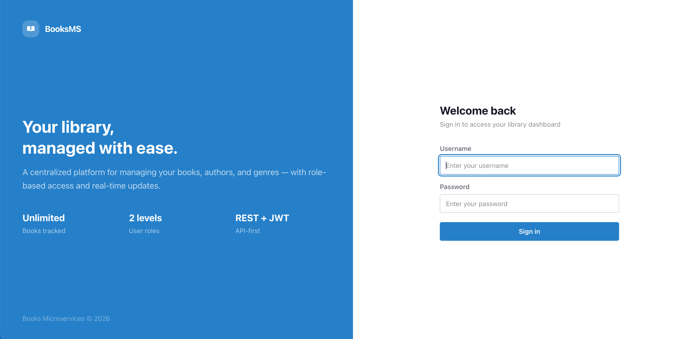
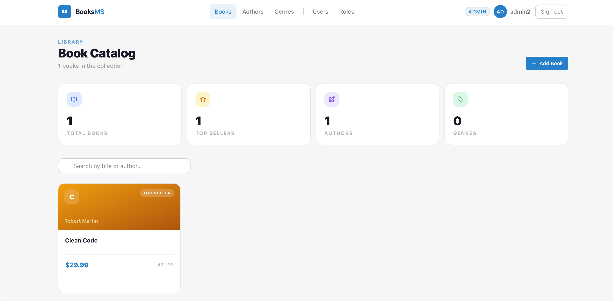
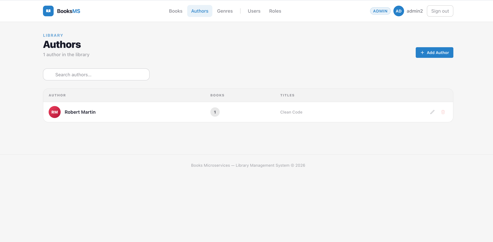
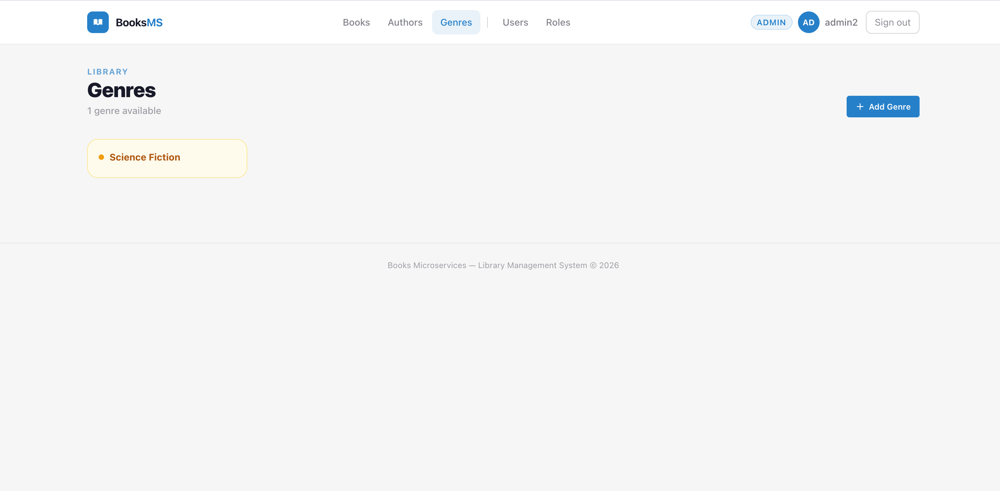
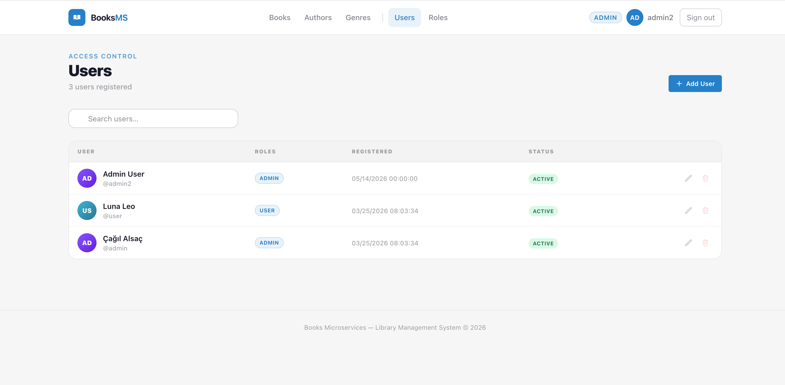
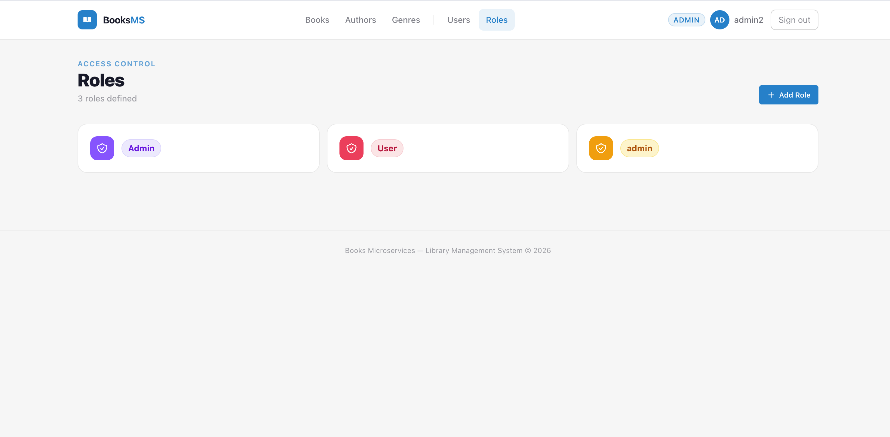

# Books Microservices

A full-stack library management system built with **.NET 8** microservices on the backend and **React 18** on the frontend. Features JWT authentication with refresh tokens, role-based access control, and a modern responsive UI.

---

## Screenshots

| Login | Books |
|-------|-------|
|  |  |

| Authors | Genres |
|---------|--------|
|  |  |

| Users (Admin) | Roles (Admin) |
|---------------|---------------|
|  |  |

> Place your screenshots in `docs/screenshots/` with the filenames above.

---

## Tech Stack

**Backend**
- .NET 8 — ASP.NET Core Web API
- Entity Framework Core — SQLite
- JWT Bearer Authentication + Refresh Tokens
- CQRS pattern via MediatR-style handlers
- Swagger / OpenAPI

**Frontend**
- React 18 + Vite + TypeScript
- Tailwind CSS v4 + DaisyUI v5 (corporate / dark themes)
- TanStack Query v5 — server state management
- Axios — HTTP client with auto refresh token interceptor
- React Router v6

---

## Architecture

```
BooksMicroservices/
├── Books.API/          # Books microservice  (port 5109)
│   └── BooksDB         # SQLite database
├── Books.APP/          # Application layer — CQRS handlers, validators
├── Books.Core/         # Domain entities and interfaces
├── Users.API/          # Users microservice (port 5265)
│   └── UsersDB         # SQLite database
├── Users.APP/          # Application layer
├── Users.Core/         # Domain entities
└── Books.Frontend/     # React SPA           (port 5174)
```

Both APIs are independent services. The frontend communicates with each via separate Axios instances.

---

## Features

- **Books** — CRUD with author, genre associations, price, page count, top seller flag
- **Authors** — CRUD with book count and title list
- **Genres** — CRUD with color-coded pill cards
- **Users** — Full user management with role assignment, active status toggle
- **Roles** — Role management for RBAC
- **Auth** — JWT login, automatic silent refresh, role-based UI gating
- **UI** — Shimmer skeleton loaders, toast notifications, animated transitions, responsive layout

---

## Prerequisites

- [.NET 8 SDK](https://dotnet.microsoft.com/download)
- [Node.js 20+](https://nodejs.org/)

---

## Running the Project

### 1 — Books API

```bash
cd Books.API
dotnet run
# → http://localhost:5109
# → Swagger: http://localhost:5109/swagger
```

### 2 — Users API

```bash
cd Users.API
dotnet run
# → http://localhost:5265
# → Swagger: http://localhost:5265/swagger
```

### 3 — Frontend

```bash
cd Books.Frontend
npm install
npm run dev
# → http://localhost:5174
```

---

## Default Accounts

| Username | Password | Role  |
|----------|----------|-------|
| `admin`  | `Admin123!` | Admin |

> Non-admin users can browse the catalog but cannot create, edit, or delete records.

---

## API Overview

### Books API — `http://localhost:5109`

| Method | Endpoint | Auth | Description |
|--------|----------|------|-------------|
| GET | `/api/Books` | — | List all books |
| GET | `/api/Books/{id}` | — | Get book by ID |
| POST | `/api/Books` | Admin | Create book |
| PUT | `/api/Books` | Admin | Update book |
| DELETE | `/api/Books/{id}` | Admin | Delete book |
| GET | `/api/Authors` | — | List all authors |
| POST | `/api/Authors` | Admin | Create author |
| PUT | `/api/Authors` | Admin | Update author |
| DELETE | `/api/Authors/{id}` | Admin | Delete author |
| GET | `/api/Genres` | — | List all genres |
| POST | `/api/Genres` | Admin | Create genre |
| PUT | `/api/Genres` | Admin | Update genre |
| DELETE | `/api/Genres/{id}` | Admin | Delete genre |

### Users API — `http://localhost:5265`

| Method | Endpoint | Auth | Description |
|--------|----------|------|-------------|
| POST | `/api/Token` | — | Login → JWT + refresh token |
| POST | `/api/RefreshToken` | — | Refresh expired JWT |
| GET | `/api/Users` | Admin | List all users |
| POST | `/api/Users` | Admin | Create user |
| PUT | `/api/Users` | Admin | Update user |
| DELETE | `/api/Users/{id}` | Admin | Delete user |
| GET | `/api/Roles` | Admin | List all roles |
| POST | `/api/Roles` | Admin | Create role |
| PUT | `/api/Roles` | Admin | Update role |
| DELETE | `/api/Roles/{id}` | Admin | Delete role |
